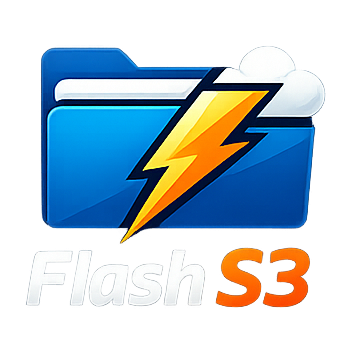

<div align="center">



# Flash S3

**A desktop S3 client for people who are done with the AWS console.**
Multi-account tabs, dual-pane transfers, and a multipart queue that actually shows you what it's doing.


### → [**Interactive overview & screenshots**](https://fzs1994.github.io/Flash-S3) ←

[Download](https://github.com/fzs1994/Flash-S3/releases) · [Issues](https://github.com/fzs1994/Flash-S3/issues) · [Release notes](RELEASE_NOTES.md)

</div>

---

## Why

The console makes you sign out to switch accounts, hides transfer progress, and can't copy between buckets. Flash S3 keeps every account in a tab, splits large objects into parallel parts you can watch and pause, and puts a second pane next to the first so a cross-account copy is one action.

Flash S3 is an Electron + Angular desktop client for Amazon S3 (and any S3-compatible endpoint), styled after [S3 Browser](https://s3browser.com/), with a fast multi-threaded transfer queue engine, a dual-pane file-manager view, and multi-account/multi-tab browsing. S3 Browser is a well-established, mature product with a much larger overall feature set (bucket policies, CloudFront, folder sync, versioning, and more — see the honest comparison below). This build focuses on making the day-to-day workflow — browsing, transferring, and moving files around — faster and more pleasant, and on running on more than one operating system.

## Features

**Connections & browsing**

- **Multi-account tabs** — save multiple AWS S3 credential profiles (access key/secret + region); open dev, stage and prod at once, each in its own tab that remembers its own bucket/folder/selection independently of the others.
- **Encrypted credentials** — profiles are encrypted at rest via Electron's OS-level `safeStorage` (DPAPI / Keychain / libsecret), with "Test Connection" before saving and a confirmation prompt before deleting one.
- **Bucket + object browser** — bucket list sidebar, breadcrumb folder navigation, Explorer-style grid (name, size, last modified, storage class).
- **Bookmarks** — star deep prefixes ("Add current" wherever you're standing) and jump straight back with one click; add, edit, and delete from a dropdown panel.
- **Local search & filters** — instantly filter the current folder's files/folders, or bucket lists, by name as you type, without hitting the network.
- **Export to CSV** — dump the current folder's full listing (every page, not just what's on screen) via a native save dialog, for an audit or a spreadsheet.
- **Dark mode**, resizable sidebar and transfer queue panel, with sizes remembered across restarts.
- **Any S3-compatible endpoint** — MinIO, Wasabi, R2, and others, not just AWS.

**Object actions**

- New folder, rename, delete (multi-select), presigned share URL generation, and properties — all from a right-click context menu on the file grid, and a blank-space context menu for the current folder.
- Copy and move objects within a bucket, across buckets, or across entirely different saved AWS accounts — folders recurse automatically, and guardrails stop you from copying a folder into itself or onto its own current location.
- Upload whole directory trees via drag-and-drop or native folder picker, structure intact.
- Toolbar buttons only appear when they're actually usable ("hide, don't disable") instead of sitting there greyed out.

**Dual-pane view**

- A classic Total-Commander-style layout: two completely independent, side-by-side browsing panes, each free to point at any saved connection and any bucket — including two different buckets in the _same_ AWS account at once.
- Drag-resizable divider between the panes, with the split remembered across restarts.
- Copy or move the current selection straight to whatever the other pane is showing, via the mini toolbar or a right-click context menu — including across different AWS accounts.

**Fast multi-threaded transfer queue**

- Any number of uploads, downloads, and copy/move operations queued at once, with a configurable number transferring concurrently (1–16, default 4), persisted across restarts.
- Parallel multipart transfers via `@aws-sdk/lib-storage` — a 150 MB archive moves as 7 concurrent parts at 8.7 MB/s — with per-part progress; chunk size is also configurable and persisted.
- Per-task pause / resume / cancel / retry, plus pause-all / resume-all; failed parts retry without restarting the whole file.
- Live progress %, transfer speed, and ETA per task, updated in real time via IPC.
- **Queue that persists** — All / Running / Queued / Error / Completed views with live counts.
- Drag-and-drop upload directly onto the file grid, plus toolbar Upload Files/Folder buttons using native OS pickers.
- Cross-pane copy/move runs through this same queue, so it's visible, cancelable, and reports errors instead of happening silently.
- Whichever open tab or pane is looking at an affected folder auto-refreshes the moment its transfer completes.

### Known limitations (v1.0.0)

- Pausing an in-flight upload/download aborts the current HTTP request; resuming restarts that file from byte 0 rather than a true byte-offset resume.
- Pausing or cancelling a copy/move only takes effect _between_ items, not mid-item, and a paused/retried copy job re-copies from the first item rather than resuming partway. Acceptable in practice since same-account S3-to-S3 copies are typically near-instant per object.
- Object versioning is not exposed — the listing shows current versions only.
- Static access keys only; IAM Identity Center, MFA and assumed roles are on the roadmap.
- Search filters the current prefix, not the whole bucket.
- Glacier objects list but can't be restored from the app.
- Cross-region moves of very large objects fall back to download + re-upload.

## How this compares to S3 Browser

[S3 Browser](https://s3browser.com/) (by Netsdk Software) is a long-running, feature-rich Windows client for Amazon S3 — this project is styled after it and owes it the UI inspiration. It's a much more mature product overall (see its [full feature list](https://s3browser.com/)), so this is an honest side-by-side rather than a claim of outright superiority:

| Area                                                                | Flash S3 (this build)                                                                    | S3 Browser                                                                                   |
| ------------------------------------------------------------------- | ---------------------------------------------------------------------------------------- | -------------------------------------------------------------------------------------------- |
| Platform                                                            | Windows, macOS, and Linux (Electron)                                                     | Windows only (incl. Windows Server)                                                          |
| Dual-pane / side-by-side browsing                                   | Yes — two independent panes, drag-resizable, cross-pane copy/move                        | No — closest equivalent is the one-way/two-way Folder Sync Tool, not a live two-pane browser |
| Multi-account, multi-tab browsing                                   | Yes — several connections open as tabs simultaneously                                    | Multiple accounts supported, but one active account view at a time                           |
| Copy/move across accounts                                           | Yes, including in the dual-pane view                                                     | Yes (a longstanding S3 Browser feature)                                                      |
| Transfer queue visibility for copy/move                             | Yes — copy/move shows up in the same queue as uploads/downloads with progress and errors | Copy/move runs as its own operation, separate from the upload/download queue                 |
| Bookmarks                                                           | Yes — add/edit/delete, "Add current"                                                     | No dedicated bookmarks; has a bucket/account list instead                                    |
| CSV export of a folder listing                                      | Yes, full paginated listing                                                              | Not a built-in export; primarily supports scripted/CLI listing                               |
| Local in-folder search/filter                                       | Yes                                                                                      | Advanced search/filtering across criteria (name, size, date, metadata)                       |
| Cost                                                                | Free, single build, no Free/Pro split                                                    | Free tier + paid Pro tier gating some features                                               |
| Folder/bucket sync tool                                             | No (see Roadmap)                                                                         | Yes — a signature, mature feature with exclusion rules, scheduling, metadata caching         |
| Bucket policy / ACL / CORS / lifecycle editors                      | No (see Roadmap)                                                                         | Yes                                                                                          |
| Versioning UI, storage class management                             | No (see Roadmap)                                                                         | Yes                                                                                          |
| CloudFront management                                               | No (see Roadmap)                                                                         | Yes                                                                                          |
| Client-side encryption, transfer acceleration, bandwidth throttling | No (see Roadmap)                                                                         | Yes                                                                                          |
| AWS SSO / IAM tooling, CLI automation                               | No (see Roadmap)                                                                         | Yes                                                                                          |

In short: this build is currently strongest where day-to-day browsing and moving files around is concerned — especially the dual-pane workflow and cross-platform support — while S3 Browser remains far ahead on bucket administration, sync, and account/security tooling. The Roadmap below tracks closing that gap.

## Install

Download an installer from the [Releases page](https://github.com/fzs1994/Flash-S3/releases):

| Platform | File                       |
| -------- | -------------------------- |
| Windows  | `Flash-S3-Setup-1.0.0.exe` |
| macOS    | `Flash-S3-1.0.0.dmg`       |
| Linux    | `Flash-S3-1.0.0.AppImage`  |

Add an account under **Connections → New**. Credentials go to the OS credential store, not the repo.

## Build from source

Requires Node 18+.

```bash
git clone https://github.com/fzs1994/Flash-S3.git
cd Flash-S3
npm install
```

```bash
npm start        # ng serve + Electron together, with dev tools open, live reload
npm run dist     # installers into release/, current platform
npm run dist:win     # Windows (nsis)
npm run dist:mac     # macOS (dmg)
npm run dist:linux   # Linux (AppImage)
```

Notes:

- Changes under `electron/` (main process, IPC, preload) require a full restart of `npm start` to take effect — only the Angular renderer live-reloads.
- Output lands in `release/`. Icons are expected at `build-resources/icon.ico` / `.icns` / `.png` — add your own before building an installer (a default Electron icon is used if they're missing, which electron-builder will warn about).

## Architecture

| Layer     | Stack            | Role                                                                           |
| --------- | ---------------- | ------------------------------------------------------------------------------ |
| Renderer  | Angular          | The whole UI; no direct filesystem or network access.                          |
| Main      | Electron / Node  | AWS SDK v3 clients, OS credential store, filesystem — reached over typed IPC.  |
| Workers   | Transfer engine  | Parts off the main thread, concurrency limit, retry-per-part, progress events. |
| Packaging | electron-builder | NSIS installer, signed DMG, AppImage from one tree.                            |

- **Electron main process** (`electron/`) owns all AWS SDK calls and the transfer queue. The Angular renderer never talks to AWS directly.
  - `electron/services/s3-manager.js` — bucket/object CRUD, cross-account copy/move, and CSV export via `@aws-sdk/client-s3`.
  - `electron/services/transfer-queue.js` — the concurrent upload/download/copy-move engine.
  - `electron/services/credential-store.js` — encrypted profile storage.
  - `electron/ipc/register.js` — wires it all to `ipcMain.handle(...)`.
  - `electron/preload.js` — the only bridge exposed to the renderer (`window.electronAPI`), via `contextBridge` with `contextIsolation: true`.
- **Angular renderer** (`src/`) is a standalone-component Angular 17 app that only ever calls `window.electronAPI.*`.
  - `core/services/*` — state + IPC-calling services: `s3-browser.service.ts` (single active-tab browsing), `pane.service.ts` (independent dual-pane browsing state), `transfer.service.ts` (transfer queue + auto-refresh), `bookmark.service.ts`, `connection.service.ts`.
  - `features/*` — UI components: toolbar, bucket tree, object grid, dual-pane view, context menu, bookmarks, transfer queue panel, connection manager, dialogs.

## Roadmap

**Object management & metadata**

- [ ] Version history: view, download, or restore previous versions of an object if bucket versioning is on.
- [ ] Tags editor: view/add/remove S3 object tags.
- [ ] Storage-class control: pick Standard/IA/Glacier/etc. on upload, or transition existing objects.

**Bucket administration**

- [ ] Bucket policy and CORS editor (raw JSON with validation).
- [ ] ACL viewer/editor per object or bucket.
- [ ] Static website hosting and lifecycle rule management.

**Sync & automation**

- [ ] Local folder → prefix sync with a dry-run diff (one-way or two-way, S3 Browser's signature "Directory Sync" feature) — still the single biggest missing feature relative to S3 Browser.
- [ ] Scheduled backups (e.g., "sync this folder nightly").

**Viewing & navigation**

- [ ] Inline preview for images/text/PDF without downloading.
- [ ] Sort/filter columns in the file list (by size, date, extension).
- [ ] Recursive/global search across all buckets in a connection, not just the current folder.
- [ ] Recently visited folders history, separate from bookmarks.

**Transfers & reliability**

- [ ] True resumable pause (currently restarts from byte 0 for uploads/downloads, and re-copies from the first item for copy/move — see Known limitations).
- [ ] Bandwidth throttling for transfers.
- [ ] A persistent transfer log/report you can export.

**Security & accounts**

- [ ] AWS SSO and assumed-role support, plus MFA.
- [ ] A "why don't I have access" IAM diagnostics helper.
- [ ] A log of presigned URLs you've generated, with the ability to revoke by rotating.
- [ ] CloudFront distribution management and invalidations.

## Security

- Credentials live in Keychain / Credential Manager / libsecret via Electron's `safeStorage`; if the OS has no available encryption backend, they fall back to base64 (not secure) — flagged in `credential-store.js` for follow-up (e.g., requiring OS keychain unlock).
- `contextIsolation: true` and `nodeIntegration: false` are enforced in `electron/main.js`; the renderer only ever sees the explicit API surface defined in `electron/preload.js`.
- Nothing leaves your machine except signed HTTPS requests to AWS (or your chosen S3-compatible endpoint) — no telemetry, no account. Presigned share links are generated locally and expire.

## Contributing

Issues and pull requests welcome. Bug reports with the failing bucket layout and a rough object count are the most useful thing you can send — please open an issue before starting anything large.

## License

MIT. Flash S3 is an independent project and is not affiliated with or endorsed by Amazon Web Services.
